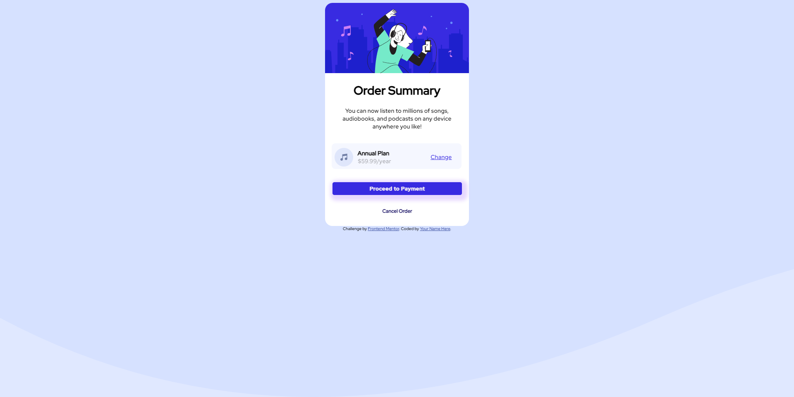

# Componente-de-resumo-do-pedido
Meu Primeiro desafio Html/Css do site https://www.frontendmentor.io/
 # Frontend Mentor - Order summary card solution

Esta é uma solução para o [Desafio do cartão de resumo do pedido no Frontend Mentor](https://www.frontendmentor.io/challenges/order-summary-component-QlPmajDUj).
## Table of contents


  - [The challenge](#the-challenge)
  - [Screenshot](#screenshot)
  - [Links](#links)
- [My process](#my-process)
  - [Built with](#built-with)
  - [What I learned](#what-i-learned)
  - [Continued development](#continued-development)
  - [Useful resources](#useful-resources)
- [Author](#author)


### The challenge

Users should be able to:

- See hover states for interactive elements
### Screenshot




## My process


### Built with
- Semantic HTML5 markup
- CSS custom properties


### What I learned

```html
<h1>Alguns códigos HTML dos quais me orgulho</h1>
```
```css
.proud-of-this-css {
  color: papayawhip;
}
```
```js
const proudOfThisFunc = () => {
  console.log('🎉')
}
```


### Continued development

Eu principalmente preciso melhorar o espaçamento em css. 
Nesta aba de desenvolvimento, se você olhar para este git, você pode me ajudar onde melhorar. obrigado.


### Useful resources
- [w3schools](https://www.w3schools.com) -Este artigo me ajudou muito em relação a css
sobre pseudo-elemento entre outras coisas


## Author

- Website - [Breno Lima](https://github.com/ONniTe/Componente-de-resumo-do-pedido)
- Frontend Mentor - [@Breno Lima](https://www.frontendmentor.io/profile/ONniTe)
